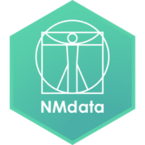

<!-- README.md is generated from README.Rmd. Please edit that file -->

# NMdata<a href='https://nmautoverse.github.io/NMdata/'></a>

<!-- badges: start -->

[](https://lifecycle.r-lib.org/articles/stages.html)
[](https://github.com/nmautoverse/NMdata/actions)
[](https://app.codecov.io/gh/nmautoverse/NMdata?branch=master)
[](https://CRAN.R-project.org/package=NMdata)
[](https://cran.r-project.org/package=NMdata)
<!-- badges: end -->

## A fast R package for efficient data preparation, consistency-checking and post-processing in PK/PD modeling

Pharmacometrics and PK/PD modeling offers unique information for
decision-making in several steps of drug development. However, it often
takes a lot of work to get there, and there are many pitfalls along the
way. NMdata helps simplifying this work and steering around the pitfalls
or at least making sure we didn’t fall into them.

### Flexibility first

Any functionality in the NMdata can be used independently of the rest of
the package, and NMdata is not intended to force you to change any
habits or preferences. Instead, NMdata tries to fit in with how you (or
your colleague who worked on the project before you) do things. It
likely provides helpful additions no matter what other tools you already
use.

### Automate book keeping and focus on modeling

Preparing data sets - and if you use NONMEM, reading the results data -
can be tedious, and mistakes can lead to hours of frustration. NMdata
provides useful tools (including automated checks) for these trivial
tasks. Highlights in data set preparation and data checking:

-   `mergeCheck()` Require left-join merging to only add columns - and
    nothing else. If rows get duplicated or disappear, throw an error.  
-   `addTAPD()` Automatically add time after previous dose, previous
    dose amount, cumulative number of doses and other related columns.
    Works with `ADDL/II` notation too.  
-   `flagsAssign()` and `flagsCount()` Automatically assign exclusion
    flags to data and tabulate number of subjects and observations
    excluded and/or retained due to each step.  
-   `NMorderColumns` Order columns in a Nonmem data set consistently and
    intuitively.  
-   `NMwriteData()` Feature-rich data writer for Nonmem data sets. Can
    return text to be used for $INPUT and $DATA sections.  
-   `NMcheckData()` Rigorous and extensive checking for structural
    errors and potential issues in Nonmem data sets.  
-   `NMcheckColnames.R()` Check data set against `INPUT` section of
    control streams.

Check out [this
vignette](https://nmautoverse.github.io/NMdata/articles/DataPrepare.html)
on data preparation.

### Read model results in a consistent table structure

While `NMdata` does not organize all results into single objects that
can be further processed, it offers efficient functions to read model
results. These functions are all built to handle multiple models and
return results in simple, consistent structures. Their results can
easily be merged as needed. Notice, all of these functions basically
just need a control stream path to run.

-   `NMscanData()` Read and combine `$TABLE` output and input data.
    Feature-rich with support for the vast majority of models. Builds on
    `NMscanInput()` to automatically read input data and
    `NMscanTables()` to read all the output tables.  
-   `NMreadExt()` A feature-rich processor of ext files. Provides final
    parameter estimates with uncertainties and everything else provided
    in the ext file, iterations, objective function value and
    termination status  
-   `NMreadParsText()` Very flexible processor of comments in control
    stream parameter sections. As long as the comments provide
    consistent parameter information in almost any format,
    `NMreadParsText()` can turn it into a table.  
-   `NMreadInits()` Read and tabulate initial values, lower, upper
    limits, FIX and block structures based on parameter sections of
    control streams.  
-   `NMrelate()` Automatically connect parameters to variable names used
    in control stream code (say, `CL=EXP(THETA(1)+ETA(1))` in control
    stream and NMrelate will “relate” `THETA(1)` and `ETA(1)` to `CL`.
    Powerful for QC and even simple parameter table generation.  
-   `NMreadPhi()` Reads individual posthoc estimates into a
    `data.frame`  
-   `NMreadCov()` Reads an estimated variance-covariance matrix and
    formats as a matrix  
-   `NMreadShk()` to read shrinkage tables

Vignettes:  
[Flexible Creation of Parameter
Tables](https://NMautoverse.github.io/NMdata/articles/ParameterTables.html)  
[NMscanData: Find And Combine All Output And Input
Data](https://NMautoverse.github.io/NMdata/articles/NMscanData.html)

### More information

The best place to browse information about the package is
[here](https://nmautoverse.github.io/NMdata/). The quickest way in is
the
[Cheatsheet](https://htmlpreview.github.io/?https://github.com/nmautoverse/NMdata/blob/master/vignettes/NMdata-cheat.html).
It does not cover any features related to generation of parameter
tables, so you may also want to take a look at that vignette.

<!-- {width="15%"} -->
<!-- [Cheatsheet](https://htmlpreview.github.io/?https://github.com/nmautoverse/NMdata/blob/master/devel/NMdata-cheat.html) -->

<a href="https://htmlpreview.github.io/?https://github.com/nmautoverse/NMdata/blob/master/vignettes/NMdata-cheat.html"></a>

Also, check out the most recent vignette on [Flexible Creation of
Parameter
Tables](https://NMautoverse.github.io/NMdata/articles/ParameterTables.html)
using NMdata.

### How to install

`NMdata` is on [CRAN](https://cran.r-project.org/package=NMdata) and
[MPN](https://mpn.metworx.com/docs/packages/NMdata). To install from the
package archive you are already using, do:

``` r
install.packages("NMdata")
library(NMdata)
```

See further below for instructions on how to install from other sources
than your default archive, if need be.

## Prepare, check, and export PK/PD data

On the data-generation side, functionality is provided for documentation
of the datasets while generating them. There are functions for automatic
checks of (some) data merges, handling and counting of exclusions flags,
final preparations for ensuring readability in NONMEM, and ensuring
traceability of datasets back to data generation scripts.

## Check data as read by NONMEM

The `NMcheckData` function will do an extensive and fully automated set
of checks of the data before you run NONMEM. And did NONMEM not behave?
`NMcheckData` can debug the data *as seen by NONMEM*. That’s right - it
has never been easier to find data bugs.

## Get the most recent version

If your archive has not been updated since July 2021, you may not find
`NMdata` if you try to install with `install.packages` (option 1). In
that case you have two other options. You can explicitly select CRAN for
the installation. Or if you should want a version that has not yet
reached CRAN, installing from Github is easy too.

``` r
## Option 1: Install from your default repository
install.packages("NMdata")

## Option 2: Install explicitly from CRAN
install.packages("NMdata",repos="https://cran.r-project.org")

## Option 3: Install from github
library(remotes)
install_github("nmautoverse/NMdata")
```

If you use the Github version, you may want to see the
[FAQ](https://nmautoverse.github.io/NMdata/articles/NMdata-FAQ.html) for
how to install specific releases from Github (ensuring reproducibility).

## Questions?

Check the
[FAQ](https://nmautoverse.github.io/NMdata/articles/NMdata-FAQ.html), or
ask on [github](https://github.com/nmautoverse/NMdata/)

## Issues?

The best way to report a bug or to request features is on
[github](https://github.com/nmautoverse/NMdata/).

## Code of Conduct

Please note that the patchwork project is released with a [Contributor
Code of
Conduct](https://nmautoverse.github.io/NMdata/CODE_OF_CONDUCT.html). By
contributing to this project, you agree to abide by its terms.
